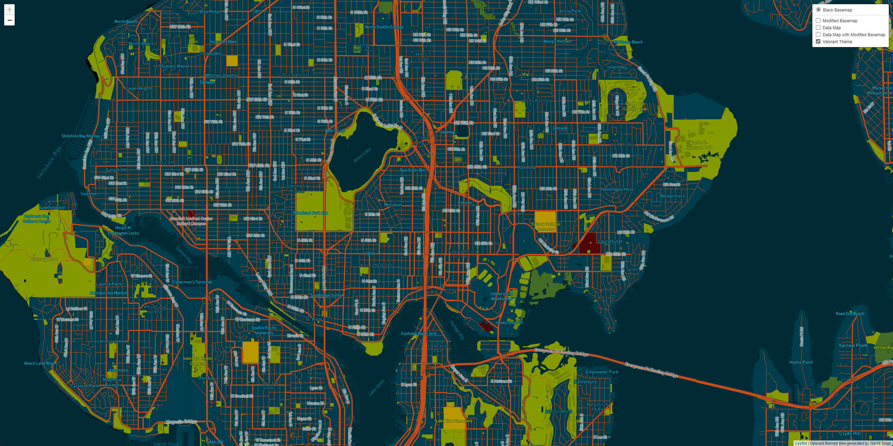

# Generating Map Tiles

## [Webmap URL](index.html)
## Tile 1 - Basemap

- Description: Basemap modified to have a better color scheme, some labels and removed building labels. 
- Geographic Area of Focus: Seattle, WA
- Zoom Levels: Max Zoom - 14; Min Zoom - 10

## Tile 2 - Road Congestion Map

- Description: Spatial data showing the traffic congestion in Seattle. 
- Geographic Area of Focus: Seattle, WA
- Zoom Levels: Max Zoom - 14; Min Zoom - 10

## Tile 3 - Road Congestion Map

- Description: Combination of the modified basemap tiles and the road congestion data tiles. 
- Geographic Area of Focus: Seattle, WA
- Zoom Levels: Max Zoom - 14; Min Zoom - 10

## Tile 4 - Road Congestion Map

- Description: Tiles generated based on the color scheme followed by the video game Valorant 
- Geographic Area of Focus: Seattle, WA
- Zoom Levels: Max Zoom - 14; Min Zoom - 10